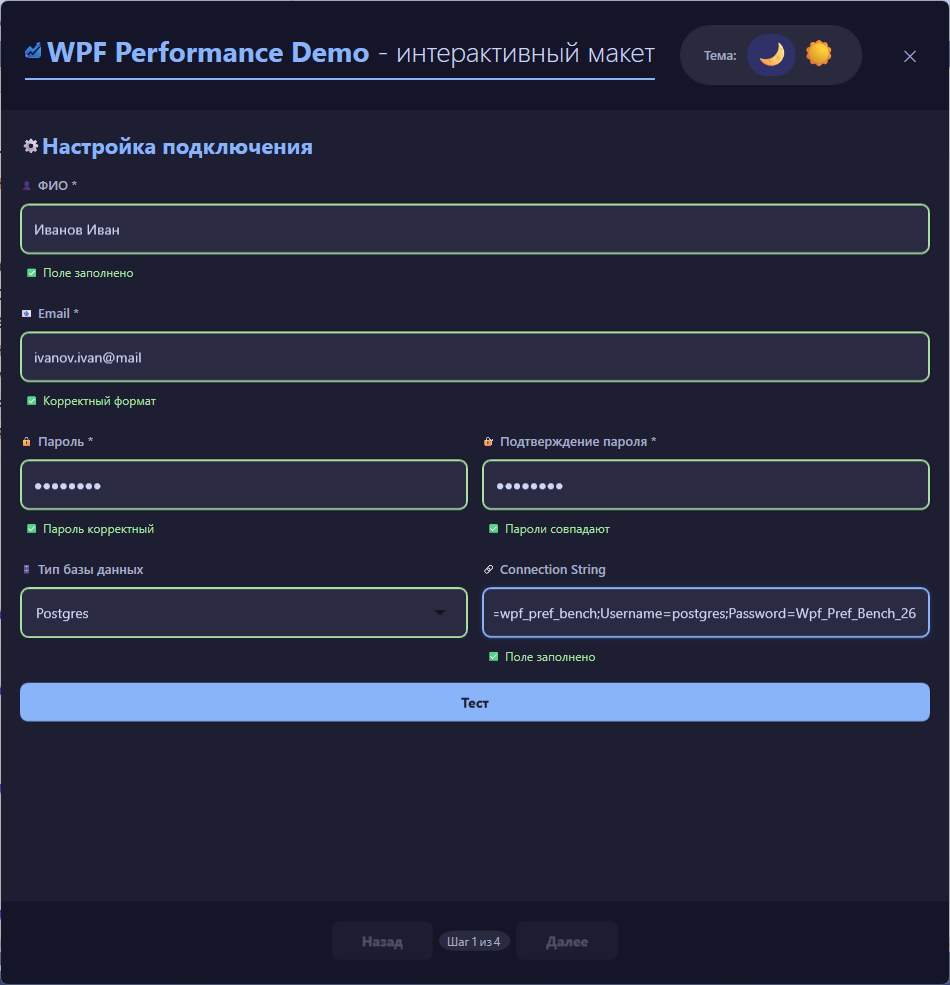
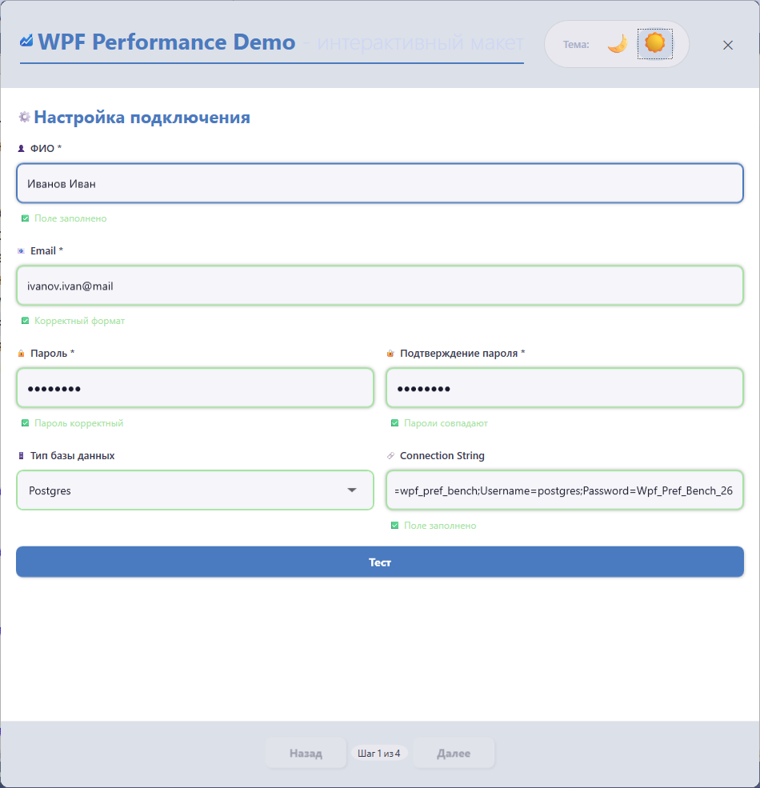
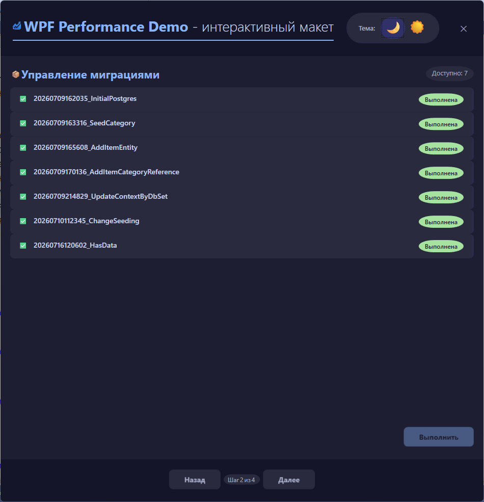
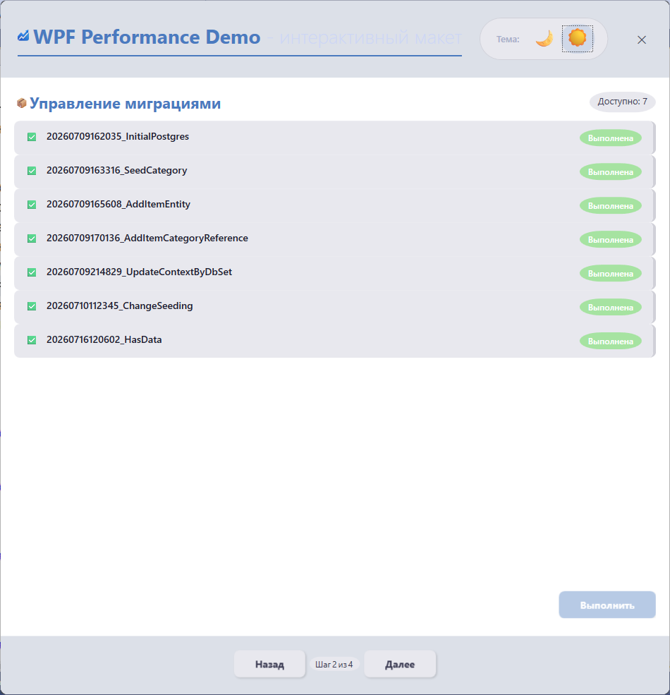
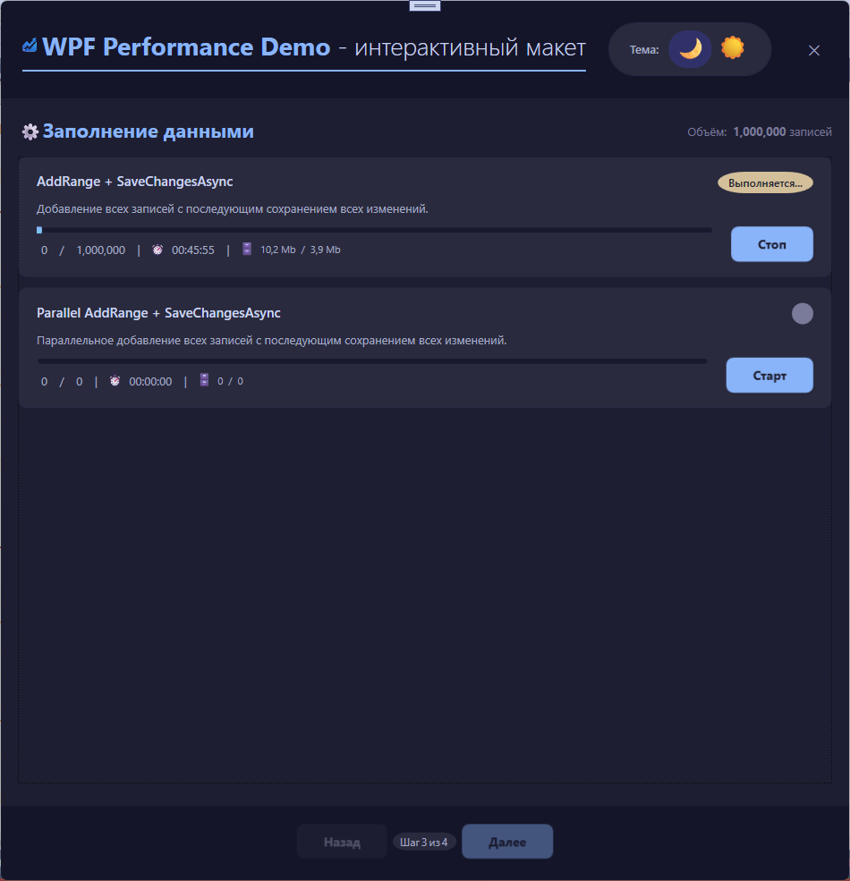
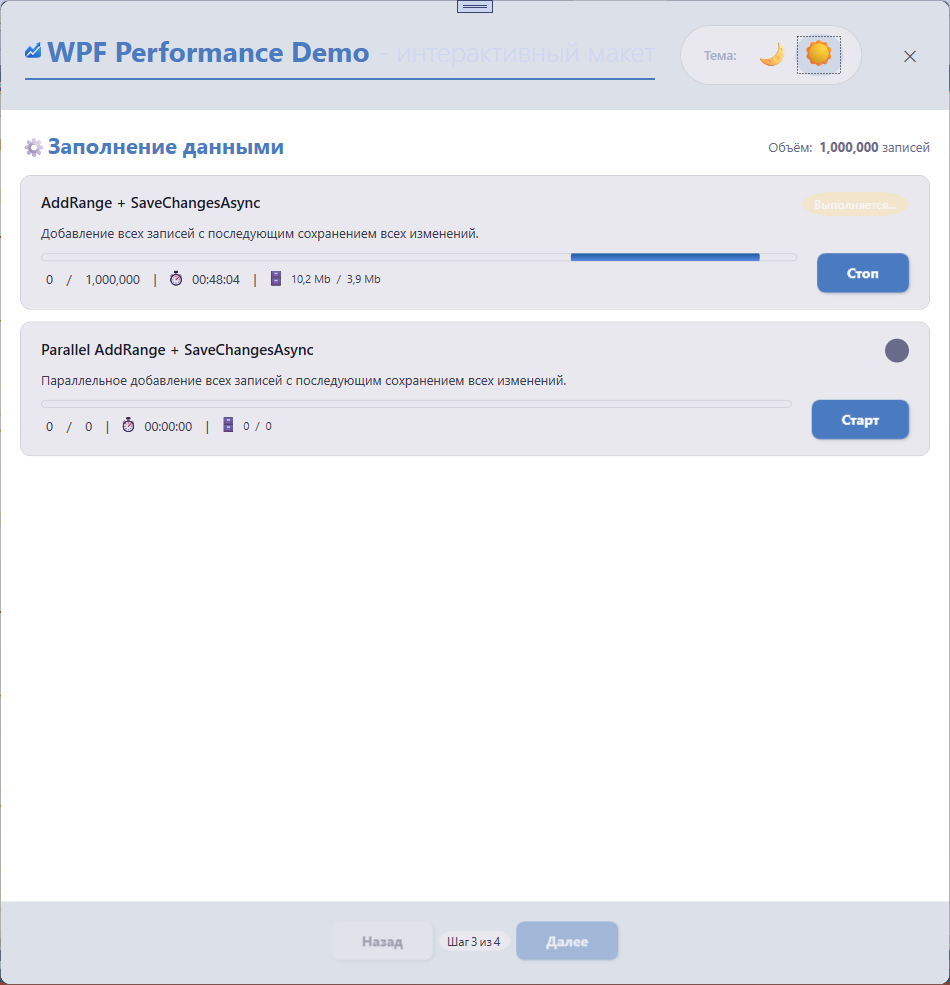
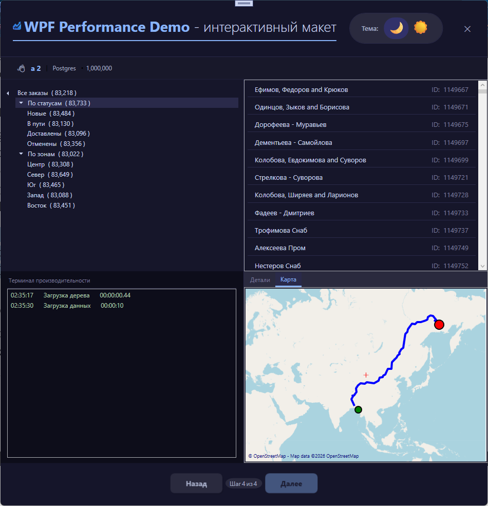
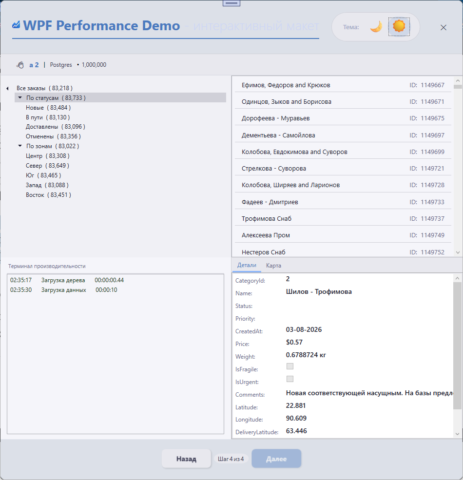

# WPF Performance Benchmark

**Интерактивный стенд для тестирования производительности WPF-приложений с интеграцией баз данных.**

Данный проект представляет собой десктопное приложение, разработанное на платформе WPF (.NET 9). Оно предназначено для демонстрации и тестирования производительности при работе с большими объемами данных, использованием различных СУБД, а также для оценки отзывчивости пользовательского интерфейса при выполнении тяжелых операций.

Приложение позволяет пользователю подключаться к базам данных (PostgreSQL или MS SQL Server), выполнять миграции, заполнять базу тестовыми данными и визуализировать иерархические структуры (категории и товары) в древовидном виде.

---

## 📑 Содержание

- [Основные возможности](#-основные-возможности)
- [Технологический стек](#-технологический-стек)
- [Архитектура и структура проекта](#-архитектура-и-структура-проекта)
- [Начало работы (Установка и запуск)](#-начало-работы-установка-и-запуск)
- [Настройка окружения](#-настройка-окружения)
- [Экранные формы и навигация](#-экранные-формы-и-навигация)
- [Управление темой](#-управление-темой)
- [Лицензия](#-лицензия)

---

## 🚀 Основные возможности

*   **Кроссплатформенная поддержка БД:** Работа с PostgreSQL и MS SQL Server через единый интерфейс.
*   **Управление миграциями:** Встроенный механизм применения миграций Entity Framework Core с визуальным отображением статуса (ожидание, применено, ошибка).
*   **Генерация тестовых данных:** Использование библиотеки `Bogus` для наполнения базы данных реалистичными данными (категории, товары с координатами, весом, ценой и т.д.).
*   **Производительный интерфейс:**
    *   Асинхронная загрузка данных с отображением индикаторов прогресса (`BusyManager`).
    *   Виртуализация данных в `TreeView` и `ListView` для плавной работы с большими списками.
*   **Визуализация данных:** Древовидное представление категорий с отображением количества вложенных элементов и `ListView` для просмотра товаров в выбранной категории.
*   **Гибкая настройка:** Поддержка светлой и темной темы оформления.
*   **Логирование:** Встроенная консоль для вывода времени выполнения операций.

## 🛠 Технологический стек

| Компонент | Технология |
| :--- | :--- |
| **Фреймворк** | .NET 9.0 |
| **UI/Платформа** | Windows Presentation Foundation (WPF) |
| **Архитектура** | MVVM (Model-View-ViewModel) |
| **DI-Контейнер** | `Microsoft.Extensions.DependencyInjection` |
| **MVVM-Инструментарий** | `CommunityToolkit.Mvvm` (Source Generators) |
| **ORM** | Entity Framework Core 9.0 |
| **Базы данных** | PostgreSQL (`Npgsql`), MS SQL Server (`SqlServer`) |
| **Маппинг** | AutoMapper |
| **Генерация данных** | Bogus |
| **Тестирование (включено)** | xUnit, Moq, FluentAssertions |
| **UI-Библиотеки** | GMap.NET (для карт, WIP), Microsoft.Xaml.Behaviors.Wpf |

---

## 📁 Архитектура и структура проекта

Проект следует принципам **Clean Architecture** и **MVVM**:
*   **Ядро:** Содержит интерфейсы, базовые классы, перечисления и общие утилиты (`Core`).
*   **Инфраструктура:** Реализация доступа к данным (`Data`), репозитории, сервисы и фабрики.
*   **Презентация:** ViewModels, Views (XAML) и Маппинг для отображения данных.
*   **Внешние зависимости:** Управление версиями пакетов централизовано через `Directory.Packages.props`.

---

## 💻 Начало работы (Установка и запуск)

### Требования
*   [.NET 9.0 SDK](https://dotnet.microsoft.com/en-us/download/dotnet/9.0)
*   [Docker Desktop](https://www.docker.com/products/docker-desktop/) (для запуска БД в контейнерах)
*   Visual Studio 2022 или JetBrains Rider

### Шаги для запуска

1.  **Клонируйте репозиторий:**
    ```bash
    git clone https://github.com/yourusername/WpfPerfBench.git
    cd WpfPerfBench
    ```

2.  **Запустите базу данных (через Docker Compose):**
    *   Для PostgreSQL (при необходимости измените имя БД (docker-compose-postgres.yml -> POSTGRES_DB):
        ```bash
        docker-compose -f docker-compose-postgres.yml up -d
        ```
    *   Для MS SQL Server (после создайте БД, например, wpf_pref_bench):
        ```bash
        docker-compose -f docker-compose-mssql.yml up -d
        ```

3.  **Настройка подключения:**
    *   При запуске приложения введите **Строку подключения** в соответствующем поле.
    *   *Пример для PostgreSQL:* `Host=localhost;Port=5432;Database=wpf_pref_bench;Username=postgres;Password=Wpf_Pref_Bench_26`
    *   *Пример для MS SQL:* `Server=localhost,1433;Database=wpf_pref_bench;User Id=sa;Password=Wpf_Pref_Bench_26;TrustServerCertificate=True;Encrypt=False`

4.  **Соберите и запустите проект:**
    ```bash
    dotnet restore
    dotnet build
    dotnet run --project WpfPerfBench/WpfPerfBench.csproj
    ```

---

## 🔧 Настройка окружения

### Базы данных в Docker
Пароли и пользователи прописаны в `docker-compose` файлах. Убедитесь, что порты `5432` и `1433` свободны или измените их в файлах `.yml`.

### Провайдеры данных
Переключение между PostgreSQL и MS SQL Server осуществляется в выпадающем списке на первом экране. Приложение автоматически использует соответствующий контекст.

---

## 📱 Экранные формы и навигация

Приложение имеет пошаговую навигацию (Wizard-style):
1.  **Init (Настройка):** Ввод ФИО, Email, пароля, выбор провайдера и проверка подключения к БД.
2.  **Migration (Миграции):** Отображение статуса миграций. Применение всех ожидающих миграций с индикацией прогресса.
3.  **Seed (Генерация):** Заполнение базы данных тестовыми данными (до 1 млн записей) с использованием выбранного метода.
4.  **Stand (Стенд):** Основная рабочая область. Иерархическое дерево категорий слева, список товаров справа. Отображается статус, количество записей и консоль производительности.

---

## 🎨 Управление темой

Переключение между **Темной** и **Светлой** темой осуществляется через иконку/переключатель в заголовке приложения (`HeaderViewModel`).
*   Темы реализованы с использованием динамических `ResourceDictionary`.
*   Все цвета и ресурсы централизованно хранятся в файлах `DarkTheme.xaml` и `LightTheme.xaml`.

---

## 📄 Лицензия

Этот проект распространяется под лицензией MIT. Подробности смотрите в файле `LICENSE`.

---

**Примечание:** Проект находится в стадии активной разработки.

## Скриншоты

<p>
    <em style="display: block; text-align: center;">Настройка подключений (тёмная и светлая темы)</em>
    <div style="display: flex; gap: 20px; justify-content: center; flex-wrap: wrap;">
      <div style="flex: 1; min-width: 300px; max-width: 700px;">
        
      </div>
      <br/>
      <div style="flex: 1; min-width: 300px; max-width: 700px;">
        
      </div>
    </div>
</p>

<p>
    <em style="display: block; text-align: center;">Управление миграциями (тёмная и светлая темы)</em>
    <div style="display: flex; gap: 20px; justify-content: center; flex-wrap: wrap;">
      <div style="flex: 1; min-width: 300px; max-width: 700px;">
        
      </div>
      <br/>
      <div style="flex: 1; min-width: 300px; max-width: 700px;">
        
      </div>
    </div>
</p>

<p>
    <em style="display: block; text-align: center;">Заполнение данными (тёмная и светлая темы)</em>
    <div style="display: flex; gap: 20px; justify-content: center; flex-wrap: wrap;">
      <div style="flex: 1; min-width: 300px; max-width: 700px;">
        
      </div>
      <br/>
      <div style="flex: 1; min-width: 300px; max-width: 700px;">
        
      </div>
    </div>
</p>

<p>
    <em style="display: block; text-align: center;">Стенд (тёмная и светлая темы)</em>
    <div style="display: flex; gap: 20px; justify-content: center; flex-wrap: wrap;">
      <div style="flex: 1; min-width: 300px; max-width: 700px;">
        
      </div>
      <br/>
      <div style="flex: 1; min-width: 300px; max-width: 700px;">
        
      </div>
    </div>
</p>